# Web Application

## Описание

Веб-приложение на Go для создания и просмотра сущностей `Thing`.

Приложение предоставляет REST API для создания `Thing` с указанием имени и получения списка созданных сущностей. Данные хранятся в памяти приложения.

Приложение развёртывается в Kubernetes в двух репликах. Для мониторинга используется Prometheus и Grafana, для централизованного сбора логов — Elastic Agent и Elasticsearch.

---

## 1. Запуск Minikube

Запустить кластер:

```bash
minikube start --driver=docker
```

Проверить состояние:

```bash
kubectl get nodes
```

Создать namespace приложения:

```bash
kubectl create namespace konstantin20092026
```

---

## 2. Сборка приложения

Сборка Docker image выполняется скриптом:

```bash
./scripts/build.sh
```

По умолчанию используется тег `local`.

Для указания собственного тега:

```bash
./scripts/build.sh -t v1
```

Скрипт собирает Docker image и загружает его в Minikube.

Проверить наличие image:

```bash
minikube image ls | grep web-app
```

---

## 3. Деплой приложения

Для установки приложения используется Helm:

```bash
./scripts/deploy.sh
```

Для указания тега Docker image:

```bash
./scripts/deploy.sh -t v1
```

Проверить состояние приложения:

```bash
kubectl get all -n konstantin20092026
```

Приложение запускается в двух репликах.

---

## 4. Работа с приложением

Получить доступ к приложению:

```bash
minikube service web-app -n konstantin20092026
```

### Создание Thing

```http
POST /things
Content-Type: application/json

{
  "name": "Laptop"
}
```

### Получение списка Thing

```http
GET /things
```

### Метрики

Метрики доступны по адресу:

```http
GET /metrics
```

Основная бизнес-метрика приложения:

```text
things_created_total
```

---

## 5. Prometheus и Grafana

Для мониторинга используется `kube-prometheus-stack`.

Установка:

```bash
helm repo add prometheus-community https://prometheus-community.github.io/helm-charts
helm repo update

helm install monitoring prometheus-community/kube-prometheus-stack \
  --namespace monitoring \
  --create-namespace \
  --version 91.4.1
```

Для сбора метрик приложения используется `ServiceMonitor`.

Проверить:

```bash
kubectl get servicemonitor -n konstantin20092026
```

Grafana:

```bash
minikube service monitoring-grafana -n monitoring
```

Для отображения количества созданных сущностей используется запрос:

```promql
sum(things_created_total)
```

Для количества созданных сущностей за последние 10 минут:

```promql
sum(increase(things_created_total[10m]))
```

Dashboard сохранён в репозитории:

```text
monitoring/grafana/metrics-dashboard.json
```

### Grafana — метрики

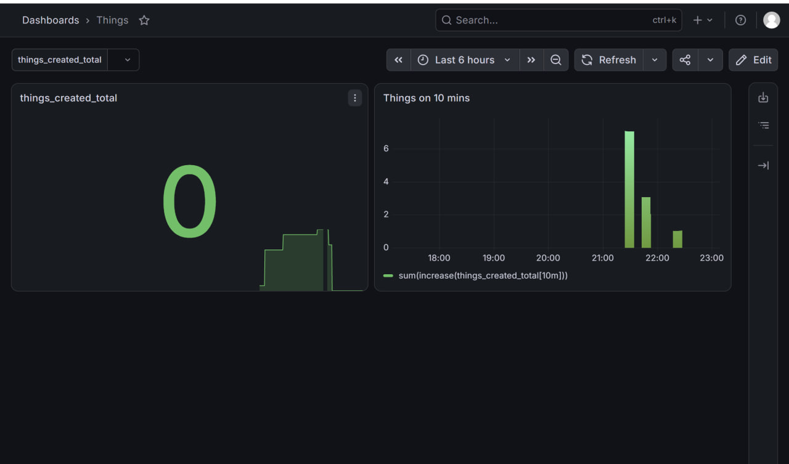

---

## 6. Сбор и просмотр логов

Для централизованного сбора логов используется Elasticsearch и Elastic Agent.

Elastic Agent получает логи контейнеров Kubernetes и отправляет их в Elasticsearch.

Проверить Elasticsearch:

```bash
kubectl get elasticsearch -n logging
kubectl get pods -n logging
```

Проверить Elastic Agent:

```bash
kubectl get daemonset -n logging
kubectl get pods -n logging
```

Логи приложения доступны в Grafana через Elasticsearch datasource.

Для отображения логов приложения используется фильтр:

```text
log.file.path:*web-app*
```

Для поиска конкретного сообщения, например создания `Thing`:

```text
log.file.path:*web-app* AND message:*thing\ created*
```

Dashboard логов сохранён в репозитории:

```text
monitoring/grafana/logs-dashboard.json
```

### Grafana — логи


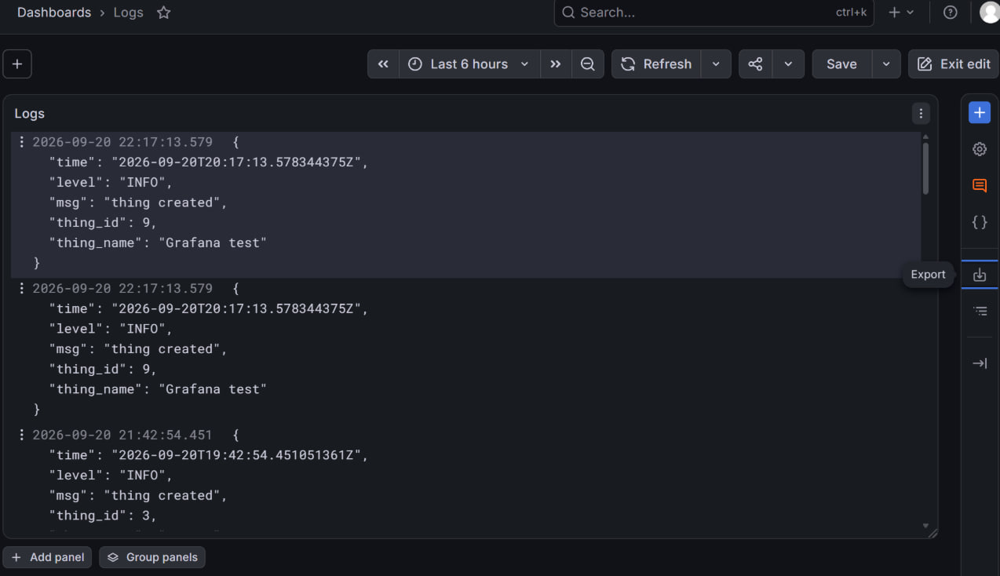
---

## 7. Kubernetes объекты

### Application Deployment

```bash
kubectl describe deployment web-app -n konstantin20092026
```
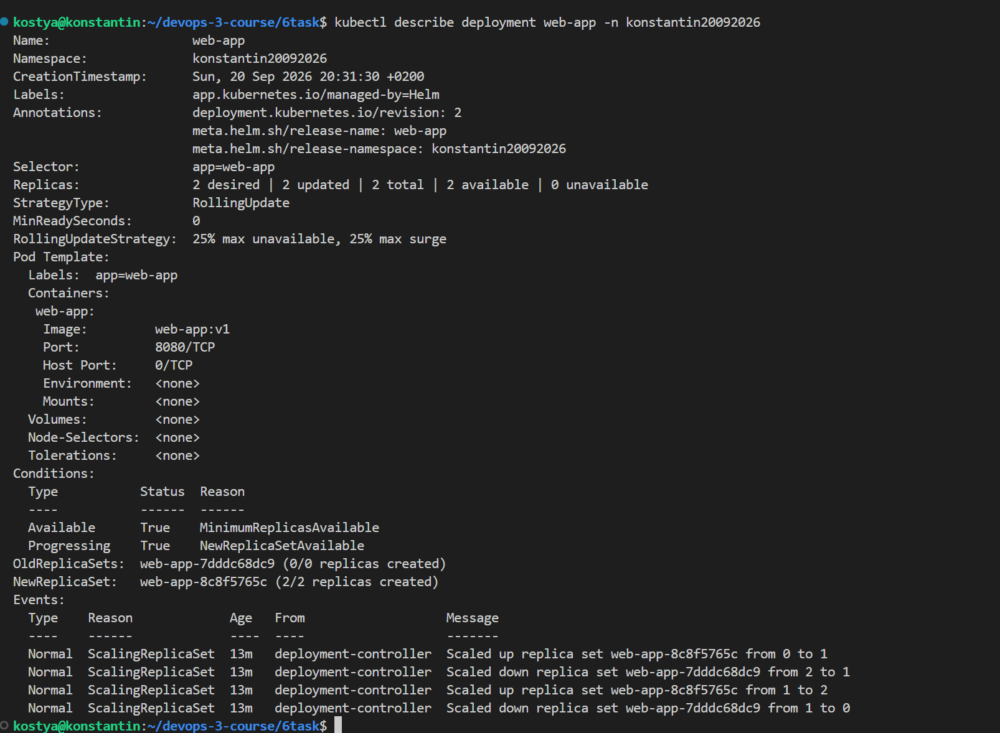

### Application Pods

```bash
kubectl describe pods -n konstantin20092026
```
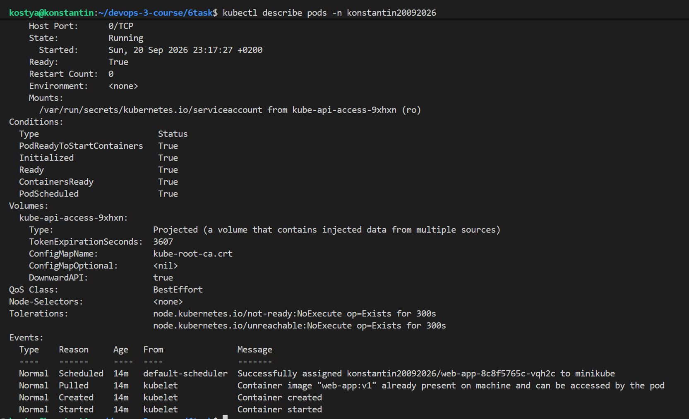
### Application Service

```bash
kubectl describe service web-app -n konstantin20092026
```
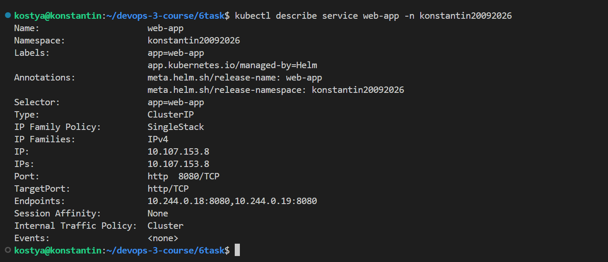


### ServiceMonitor

```bash
kubectl describe servicemonitor web-app -n konstantin20092026
```
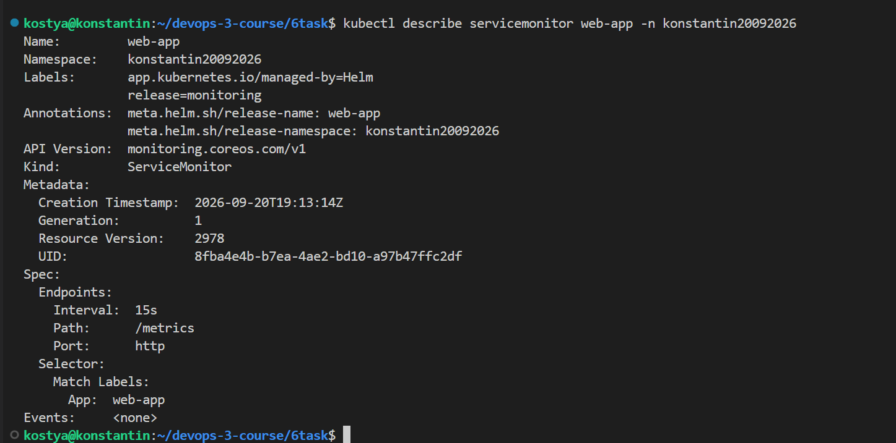

### Elasticsearch

```bash
kubectl describe elasticsearch logs -n logging
```
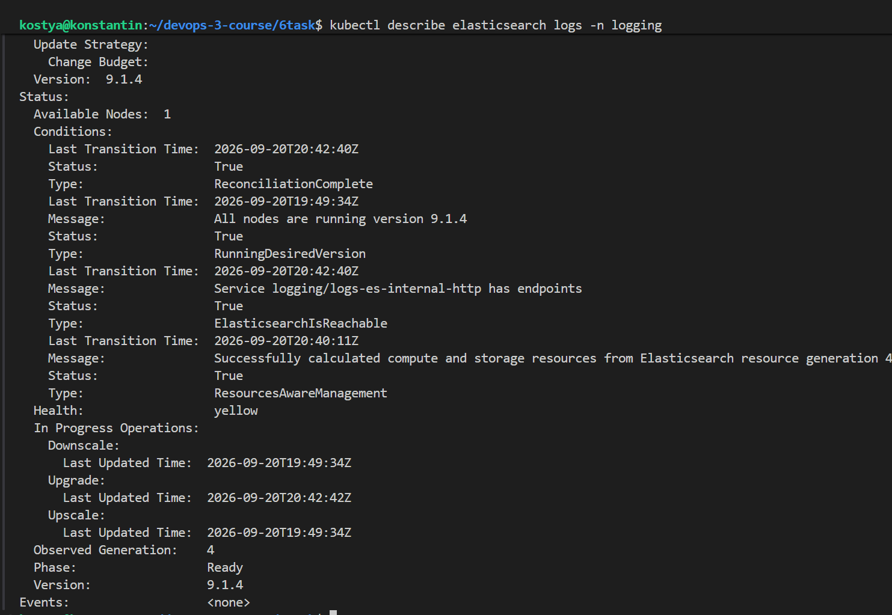

### Elastic Agent

```bash
kubectl describe daemonset elastic-agent -n logging
```
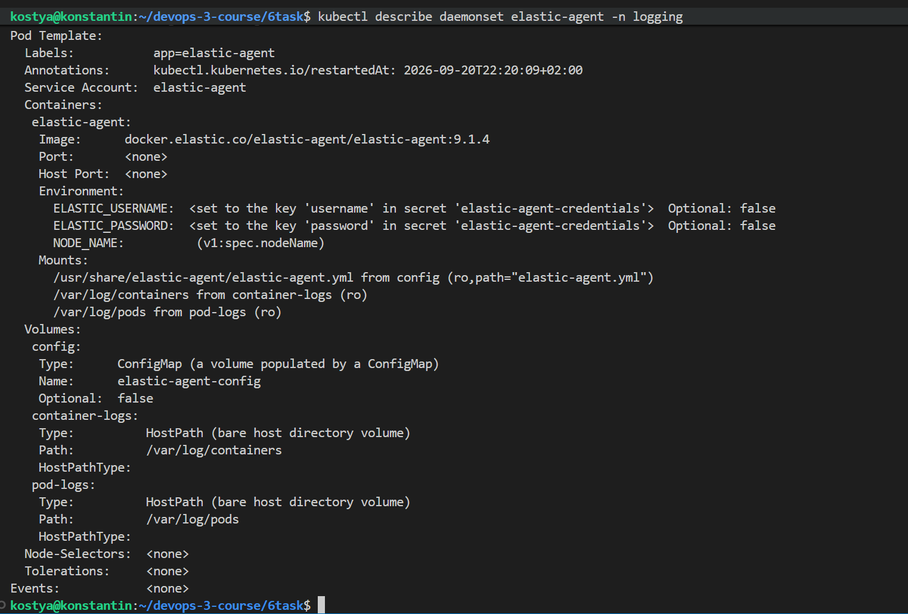

### Prometheus

```bash
kubectl describe prometheus monitoring-kube-prometheus-prometheus -n monitoring
```
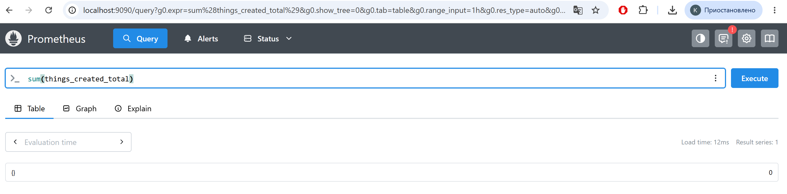

### Grafana

```bash
kubectl describe deployment monitoring-grafana -n monitoring
```
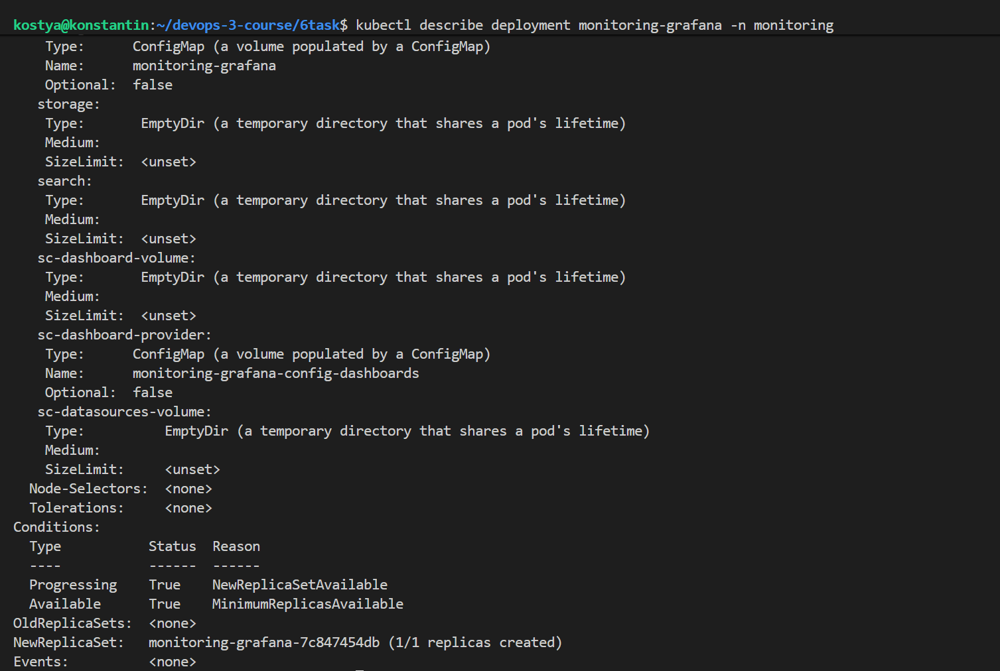
```bash
kubectl describe service monitoring-grafana -n monitoring
```
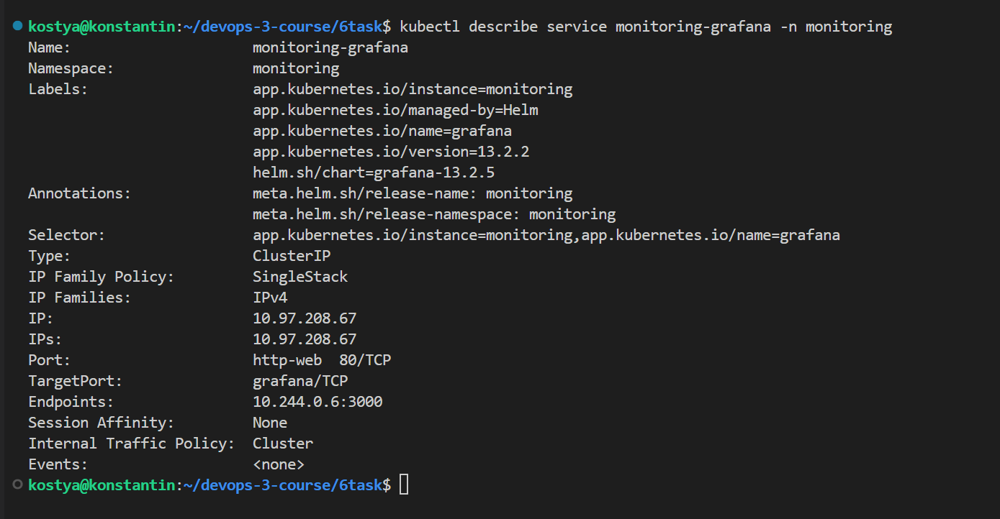
---

## 8. Проверка состояния Kubernetes

Приложение:

```bash
kubectl get all -n konstantin20092026
```
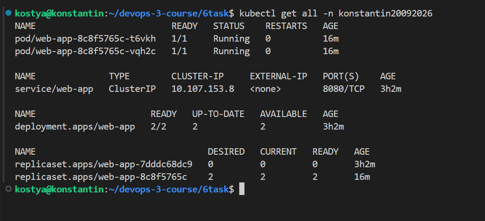
Логирование:

```bash
kubectl get all -n logging
```
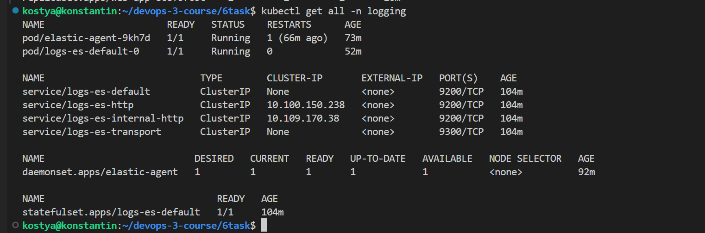
Мониторинг:

```bash
kubectl get all -n monitoring
```
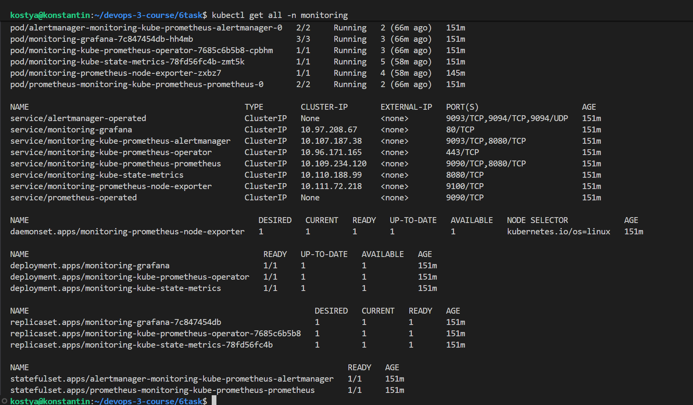
ServiceMonitor:

```bash
kubectl get servicemonitor -A
```
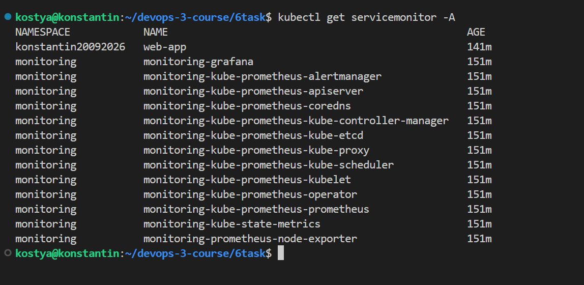